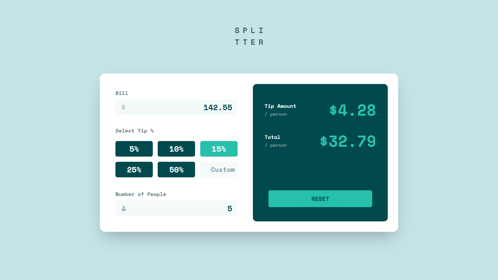

<!-- FEM Logo -->

  

  <h1 align="center">Tip Calculator App</h1>
  

    <a href="https://www.frontendmentor.io/solutions/responsive-time-tracking-dashboard-using-reactjs-and-tailwindcss-c2gATYyXAe"><strong>Frontend Mentor Challenge</strong></a>
     
  

<!-- Bagdes -->

  <!-- Profile -->
   &nbsp;
  <!-- Status -->
     &nbsp;
  <!-- Difficulty -->
    

 
<!-- Live Site -->

  <a href="https://tip-calculator-app-arshad-ali.vercel.app/">
    -9757f1?style=for-the-badge" alt="Live Demo">
  </a> &nbsp;
  <a href="https://github.com/IamArshadAli/tip-calculator-app">
    -9757f1?style=for-the-badge" alt="Solution">
  </a>

#
<!-- Screenshot -->

  

This is a solution to the [Tip Calculator App challenge on Frontend Mentor](https://www.frontendmentor.io/challenges/tip-calculator-app-ugJNGbJUX). Frontend Mentor challenges help you improve your coding skills by building realistic projects.

 

## Pagespeed Insights Score:

 ||
  | :-----: |
  |  <b>Overall Score: 🖥️ 97% \| 📱 95%</b> |
  | |
  |  |
  | |
  | Check out [**Pagespeed Insights**](https://pagespeed.web.dev/analysis/https-tip-calculator-app-arshad-ali-vercel-app/o8z101hkwb?form_factor=desktop) to get live score |
  ||

 

## ⚔️ The Challenge

Your users should be able to:

- [✔️] Calculate the correct tip and total cost of the bill per person
- [✔️] View the optimal layout for the app depending on their device's screen size
- [✔️] See hover states for all interactive elements on the page

 

## ⚙️ Built with 🤍 using

  &nbsp;  &nbsp;  &nbsp; 

 

## 🤝 Let's Connect 👇

   &nbsp;
   &nbsp;
  

 

>Code Together &nbsp;&nbsp;|&nbsp;&nbsp; Learn Together &nbsp;&nbsp;| &nbsp;&nbsp;Grow Together